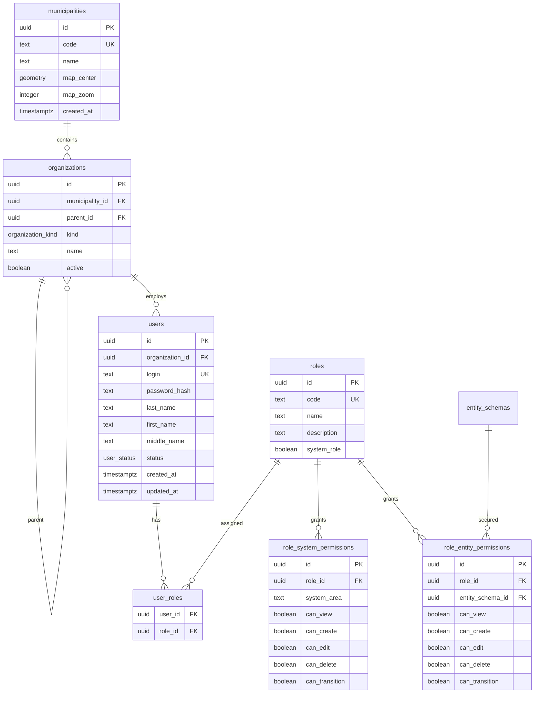
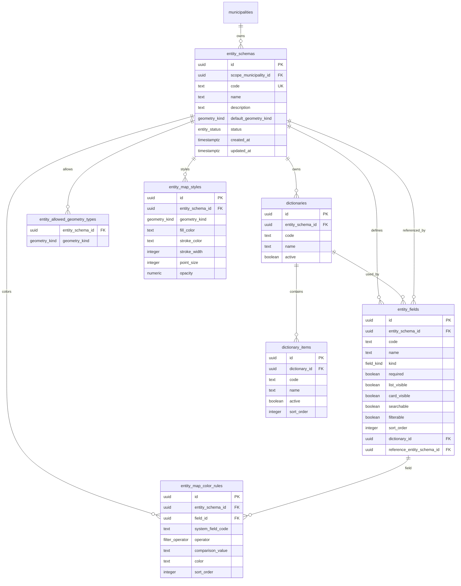
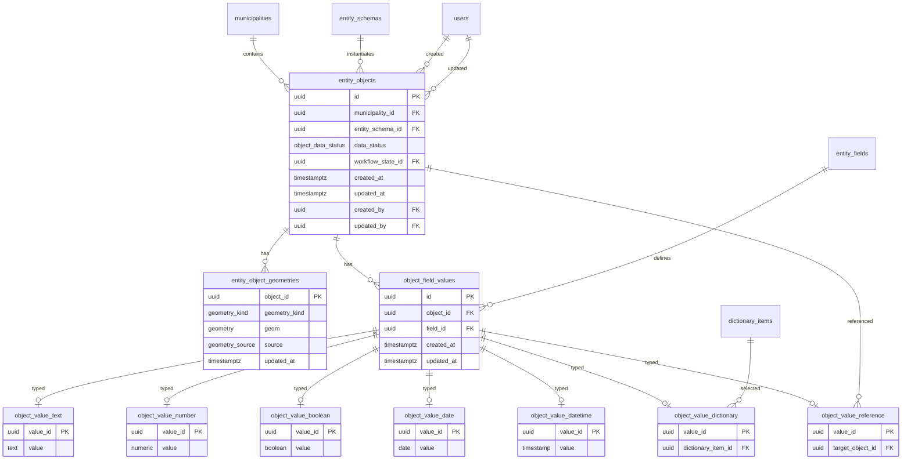
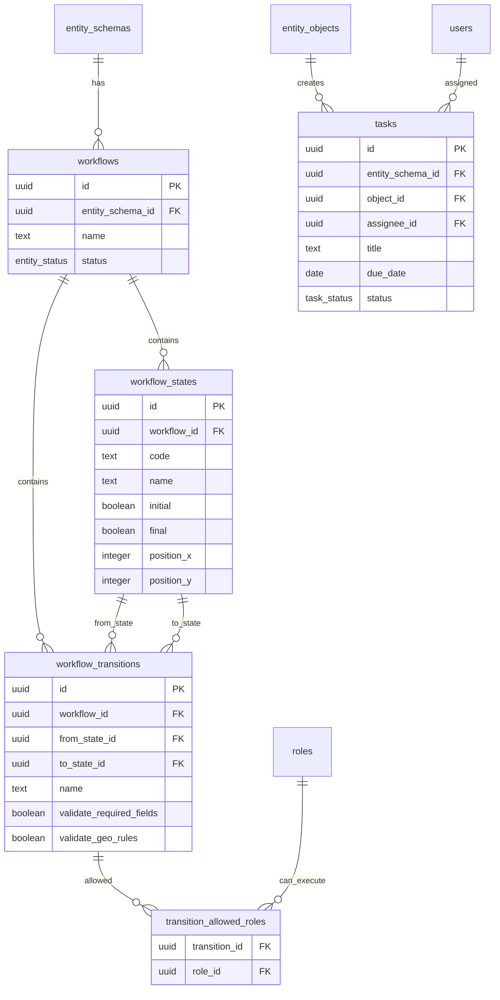
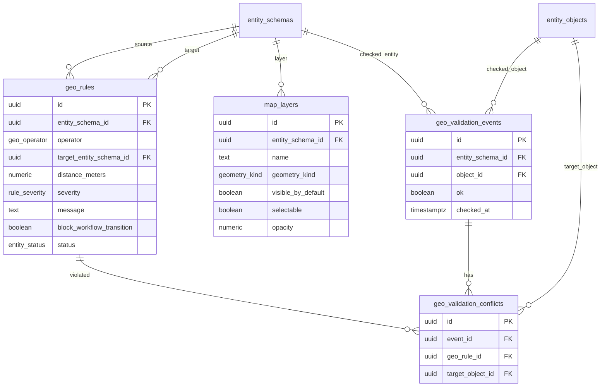
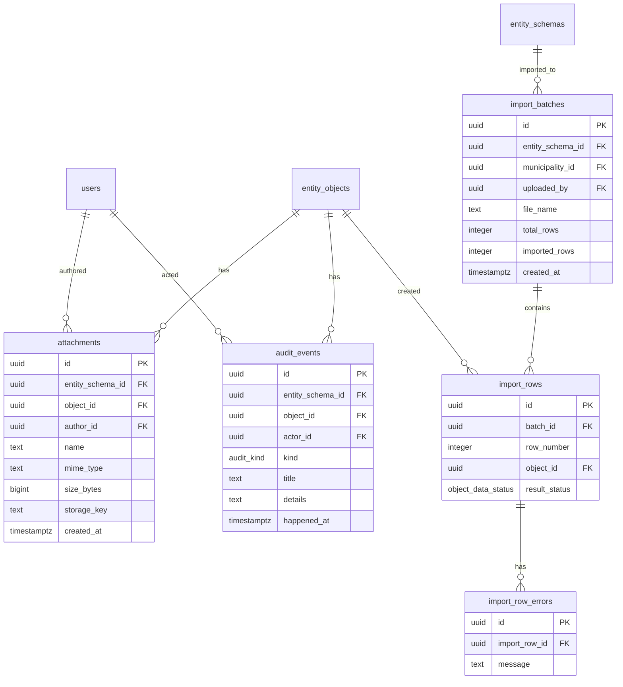
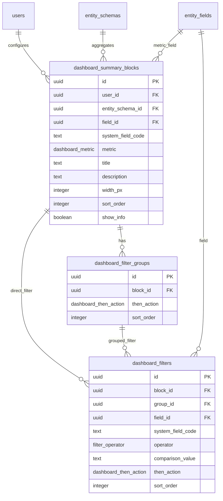
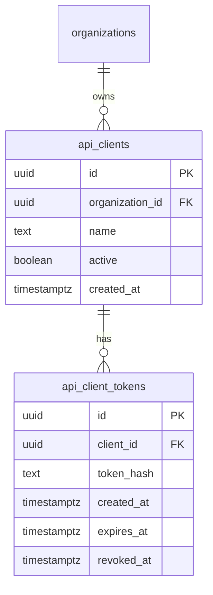

# PostgreSQL 3НФ Схема Платформы

Документ описывает целевую схему PostgreSQL для production-версии low-code GIS-платформы. Модель рассчитана на муниципальных работников, контролирующие органы и региональный уровень, поэтому учитывает несколько муниципалитетов, организации, роли, процессы, карту, импорт, аудит и API.

## Принципы

- PostgreSQL + PostGIS: геометрии хранятся в `geometry(Geometry, 4326)`.
- 3НФ: справочники, поля, значения, роли, фильтры и настройки карты вынесены в отдельные таблицы.
- Без `jsonb` для ключевой бизнес-модели. `jsonb` допустим только для технических логов интеграций, но в базовой схеме не используется.
- Динамические поля сущностей хранятся через нормализованную typed-value модель: общая таблица значения + отдельные таблицы по типам.
- Схемы сущностей могут быть общими для региона или привязанными к конкретному муниципалитету.
- Объекты всегда привязаны к муниципалитету, даже если схема сущности общая.

## Расширения И Типы

```sql
create extension if not exists pgcrypto;
create extension if not exists postgis;

create type entity_status as enum ('draft', 'active', 'archived');
create type geometry_kind as enum ('none', 'point', 'line_string', 'polygon');
create type field_kind as enum (
  'string',
  'text',
  'integer',
  'decimal',
  'boolean',
  'date',
  'datetime',
  'address',
  'enum',
  'reference',
  'file'
);
create type organization_kind as enum ('municipality', 'department', 'contractor', 'supervisor', 'system');
create type user_status as enum ('active', 'blocked');
create type object_data_status as enum ('draft', 'published');
create type task_status as enum ('new', 'in_progress', 'done', 'overdue');
create type geo_operator as enum ('intersects', 'within', 'distance');
create type rule_severity as enum ('warning', 'error');
create type audit_kind as enum ('change', 'workflow', 'document', 'import', 'system');
create type dashboard_metric as enum ('count', 'filled', 'empty', 'unique', 'sum', 'average');
create type dashboard_then_action as enum ('none', 'green', 'yellow', 'red');
create type filter_operator as enum (
  'equals',
  'not_equals',
  'contains',
  'filled',
  'empty',
  'today',
  'before_today',
  'after_today',
  'before',
  'after'
);
create type geometry_source as enum ('manual', 'address', 'nominatim', 'import');
```

## 1. Организации, Пользователи, Роли



### Таблицы

`municipalities`

- `id uuid primary key default gen_random_uuid()`
- `code text not null unique`
- `name text not null`
- `map_center geometry(Point, 4326)`
- `map_zoom integer not null default 12`
- `created_at timestamptz not null default now()`

`organizations`

- `id uuid primary key default gen_random_uuid()`
- `municipality_id uuid references municipalities(id)`
- `parent_id uuid references organizations(id)`
- `kind organization_kind not null`
- `name text not null`
- `active boolean not null default true`

`users`

- `id uuid primary key default gen_random_uuid()`
- `organization_id uuid not null references organizations(id)`
- `login text not null unique`
- `password_hash text not null`
- `last_name text not null`
- `first_name text not null`
- `middle_name text`
- `status user_status not null default 'active'`
- `created_at timestamptz not null default now()`
- `updated_at timestamptz not null default now()`

`roles`

- `id uuid primary key default gen_random_uuid()`
- `code text not null unique`
- `name text not null`
- `description text`
- `system_role boolean not null default false`

`user_roles`

- `user_id uuid not null references users(id) on delete cascade`
- `role_id uuid not null references roles(id) on delete cascade`
- `primary key (user_id, role_id)`

`role_system_permissions`

- `id uuid primary key default gen_random_uuid()`
- `role_id uuid not null references roles(id) on delete cascade`
- `system_area text not null`
- `can_view boolean not null default false`
- `can_create boolean not null default false`
- `can_edit boolean not null default false`
- `can_delete boolean not null default false`
- `can_transition boolean not null default false`
- `unique (role_id, system_area)`

`role_entity_permissions`

- `id uuid primary key default gen_random_uuid()`
- `role_id uuid not null references roles(id) on delete cascade`
- `entity_schema_id uuid not null references entity_schemas(id) on delete cascade`
- `can_view boolean not null default false`
- `can_create boolean not null default false`
- `can_edit boolean not null default false`
- `can_delete boolean not null default false`
- `can_transition boolean not null default false`
- `unique (role_id, entity_schema_id)`

## 2. Конструктор Сущностей И Справочники



### Таблицы

`entity_schemas`

- `id uuid primary key default gen_random_uuid()`
- `scope_municipality_id uuid references municipalities(id)`
- `code text not null`
- `name text not null`
- `description text`
- `default_geometry_kind geometry_kind not null default 'none'`
- `status entity_status not null default 'draft'`
- `created_at timestamptz not null default now()`
- `updated_at timestamptz not null default now()`
- `unique (scope_municipality_id, code)`

`entity_fields`

- `id uuid primary key default gen_random_uuid()`
- `entity_schema_id uuid not null references entity_schemas(id) on delete cascade`
- `code text not null`
- `name text not null`
- `kind field_kind not null`
- `required boolean not null default false`
- `list_visible boolean not null default true`
- `card_visible boolean not null default true`
- `searchable boolean not null default true`
- `filterable boolean not null default true`
- `sort_order integer not null`
- `dictionary_id uuid references dictionaries(id)`
- `reference_entity_schema_id uuid references entity_schemas(id)`
- `unique (entity_schema_id, code)`
- `unique (entity_schema_id, sort_order)`

Ограничения для 3НФ и целостности:

- если `kind = 'enum'`, должен быть заполнен `dictionary_id`;
- если `kind = 'reference'`, должен быть заполнен `reference_entity_schema_id`;
- для остальных типов эти FK должны быть `null`.

`dictionaries`

- `id uuid primary key default gen_random_uuid()`
- `entity_schema_id uuid not null references entity_schemas(id) on delete cascade`
- `code text not null`
- `name text not null`
- `active boolean not null default true`
- `unique (entity_schema_id, code)`

`dictionary_items`

- `id uuid primary key default gen_random_uuid()`
- `dictionary_id uuid not null references dictionaries(id) on delete cascade`
- `code text not null`
- `name text not null`
- `active boolean not null default true`
- `sort_order integer not null default 0`
- `unique (dictionary_id, code)`

`entity_allowed_geometry_types`

- `entity_schema_id uuid not null references entity_schemas(id) on delete cascade`
- `geometry_kind geometry_kind not null`
- `primary key (entity_schema_id, geometry_kind)`
- `check (geometry_kind <> 'none')`

`entity_map_styles`

- `id uuid primary key default gen_random_uuid()`
- `entity_schema_id uuid not null references entity_schemas(id) on delete cascade`
- `geometry_kind geometry_kind not null`
- `fill_color text not null`
- `stroke_color text not null`
- `stroke_width integer not null default 2`
- `point_size integer not null default 8`
- `opacity numeric(3, 2) not null default 0.8`
- `unique (entity_schema_id, geometry_kind)`

`entity_map_color_rules`

- `id uuid primary key default gen_random_uuid()`
- `entity_schema_id uuid not null references entity_schemas(id) on delete cascade`
- `field_id uuid references entity_fields(id)`
- `system_field_code text`
- `operator filter_operator not null`
- `comparison_value text`
- `color text not null`
- `sort_order integer not null default 0`
- `check ((field_id is not null) <> (system_field_code is not null))`

## 3. Объекты Сущностей И Значения Полей

Динамические значения вынесены в typed-value модель. Это важнее, чем хранить все в `jsonb`, потому что:

- справочники и ссылки получают FK;
- даты и числа можно индексировать и фильтровать нативно;
- контролирующие органы получают валидируемую структуру, а не произвольный JSON;
- схема соответствует 3НФ.



### Таблицы

`entity_objects`

- `id uuid primary key default gen_random_uuid()`
- `municipality_id uuid not null references municipalities(id)`
- `entity_schema_id uuid not null references entity_schemas(id)`
- `data_status object_data_status not null default 'draft'`
- `workflow_state_id uuid references workflow_states(id)`
- `created_at timestamptz not null default now()`
- `updated_at timestamptz not null default now()`
- `created_by uuid not null references users(id)`
- `updated_by uuid not null references users(id)`

`entity_object_geometries`

- `object_id uuid primary key references entity_objects(id) on delete cascade`
- `geometry_kind geometry_kind not null`
- `geom geometry(Geometry, 4326) not null`
- `source geometry_source not null default 'manual'`
- `updated_at timestamptz not null default now()`
- `check (geometry_kind <> 'none')`

Рекомендуемые индексы:

```sql
create index entity_object_geometries_geom_gix
  on entity_object_geometries using gist (geom);
```

`object_field_values`

- `id uuid primary key default gen_random_uuid()`
- `object_id uuid not null references entity_objects(id) on delete cascade`
- `field_id uuid not null references entity_fields(id) on delete cascade`
- `created_at timestamptz not null default now()`
- `updated_at timestamptz not null default now()`
- `unique (object_id, field_id)`

Typed-value таблицы:

```sql
create table object_value_text (
  value_id uuid primary key references object_field_values(id) on delete cascade,
  value text not null
);

create table object_value_number (
  value_id uuid primary key references object_field_values(id) on delete cascade,
  value numeric not null
);

create table object_value_boolean (
  value_id uuid primary key references object_field_values(id) on delete cascade,
  value boolean not null
);

create table object_value_date (
  value_id uuid primary key references object_field_values(id) on delete cascade,
  value date not null
);

create table object_value_datetime (
  value_id uuid primary key references object_field_values(id) on delete cascade,
  value timestamp not null
);

create table object_value_dictionary (
  value_id uuid primary key references object_field_values(id) on delete cascade,
  dictionary_item_id uuid not null references dictionary_items(id)
);

create table object_value_reference (
  value_id uuid primary key references object_field_values(id) on delete cascade,
  target_object_id uuid not null references entity_objects(id)
);
```

Для `date` используется `date`. Для пользовательского `datetime` лучше `timestamp without time zone`, потому что в муниципальных формах это обычно локальное время события или срока. Для системных событий (`created_at`, `audit.at`) используется `timestamptz`.

## 4. Процессы, Статусы, Задачи



### Таблицы

`workflows`

- `id uuid primary key default gen_random_uuid()`
- `entity_schema_id uuid not null references entity_schemas(id) on delete cascade`
- `name text not null`
- `status entity_status not null default 'draft'`
- `unique (entity_schema_id, name)`

`workflow_states`

- `id uuid primary key default gen_random_uuid()`
- `workflow_id uuid not null references workflows(id) on delete cascade`
- `code text not null`
- `name text not null`
- `initial boolean not null default false`
- `final boolean not null default false`
- `position_x integer not null default 0`
- `position_y integer not null default 0`
- `unique (workflow_id, code)`

`workflow_transitions`

- `id uuid primary key default gen_random_uuid()`
- `workflow_id uuid not null references workflows(id) on delete cascade`
- `from_state_id uuid not null references workflow_states(id) on delete cascade`
- `to_state_id uuid not null references workflow_states(id) on delete cascade`
- `name text not null`
- `validate_required_fields boolean not null default true`
- `validate_geo_rules boolean not null default true`

`transition_allowed_roles`

- `transition_id uuid not null references workflow_transitions(id) on delete cascade`
- `role_id uuid not null references roles(id) on delete cascade`
- `primary key (transition_id, role_id)`

`tasks`

- `id uuid primary key default gen_random_uuid()`
- `entity_schema_id uuid not null references entity_schemas(id)`
- `object_id uuid not null references entity_objects(id) on delete cascade`
- `assignee_id uuid not null references users(id)`
- `title text not null`
- `due_date date not null`
- `status task_status not null default 'new'`
- `created_at timestamptz not null default now()`
- `completed_at timestamptz`

## 5. Гео-Правила, Слои, Контроль



### Таблицы

`geo_rules`

- `id uuid primary key default gen_random_uuid()`
- `name text not null`
- `entity_schema_id uuid not null references entity_schemas(id) on delete cascade`
- `operator geo_operator not null`
- `target_entity_schema_id uuid not null references entity_schemas(id)`
- `distance_meters numeric`
- `severity rule_severity not null default 'warning'`
- `message text not null`
- `block_workflow_transition boolean not null default false`
- `status entity_status not null default 'draft'`

`map_layers`

- `id uuid primary key default gen_random_uuid()`
- `entity_schema_id uuid not null references entity_schemas(id) on delete cascade`
- `name text not null`
- `geometry_kind geometry_kind not null`
- `visible_by_default boolean not null default true`
- `selectable boolean not null default true`
- `opacity numeric(3, 2) not null default 0.8`
- `fill_color text`
- `stroke_color text`
- `stroke_width integer`
- `point_size integer`

`geo_validation_events`

- `id uuid primary key default gen_random_uuid()`
- `entity_schema_id uuid not null references entity_schemas(id)`
- `object_id uuid not null references entity_objects(id) on delete cascade`
- `ok boolean not null`
- `checked_at timestamptz not null default now()`
- `checked_by uuid references users(id)`

`geo_validation_conflicts`

- `id uuid primary key default gen_random_uuid()`
- `event_id uuid not null references geo_validation_events(id) on delete cascade`
- `geo_rule_id uuid not null references geo_rules(id)`
- `target_object_id uuid not null references entity_objects(id)`

## 6. Документы, Аудит, Импорт



### Таблицы

`attachments`

- `id uuid primary key default gen_random_uuid()`
- `entity_schema_id uuid not null references entity_schemas(id)`
- `object_id uuid not null references entity_objects(id) on delete cascade`
- `author_id uuid not null references users(id)`
- `name text not null`
- `mime_type text`
- `size_bytes bigint`
- `storage_key text not null`
- `created_at timestamptz not null default now()`

`audit_events`

- `id uuid primary key default gen_random_uuid()`
- `entity_schema_id uuid not null references entity_schemas(id)`
- `object_id uuid not null references entity_objects(id) on delete cascade`
- `actor_id uuid references users(id)`
- `kind audit_kind not null`
- `title text not null`
- `details text`
- `happened_at timestamptz not null default now()`

`import_batches`

- `id uuid primary key default gen_random_uuid()`
- `entity_schema_id uuid not null references entity_schemas(id)`
- `municipality_id uuid not null references municipalities(id)`
- `uploaded_by uuid not null references users(id)`
- `file_name text not null`
- `total_rows integer not null default 0`
- `imported_rows integer not null default 0`
- `created_at timestamptz not null default now()`

`import_rows`

- `id uuid primary key default gen_random_uuid()`
- `batch_id uuid not null references import_batches(id) on delete cascade`
- `row_number integer not null`
- `object_id uuid references entity_objects(id)`
- `result_status object_data_status not null default 'draft'`
- `geometry_status text`
- `unique (batch_id, row_number)`

`import_row_errors`

- `id uuid primary key default gen_random_uuid()`
- `import_row_id uuid not null references import_rows(id) on delete cascade`
- `message text not null`

## 7. Главный Экран И Саммари



### Таблицы

`dashboard_summary_blocks`

- `id uuid primary key default gen_random_uuid()`
- `user_id uuid not null references users(id) on delete cascade`
- `entity_schema_id uuid not null references entity_schemas(id) on delete cascade`
- `field_id uuid references entity_fields(id)`
- `system_field_code text`
- `metric dashboard_metric not null`
- `title text not null`
- `description text not null default ''`
- `width_px integer not null default 220`
- `sort_order integer not null default 0`
- `show_info boolean not null default false`
- `check ((field_id is not null) or (system_field_code is not null) or (metric = 'count'))`

`dashboard_filter_groups`

- `id uuid primary key default gen_random_uuid()`
- `block_id uuid not null references dashboard_summary_blocks(id) on delete cascade`
- `then_action dashboard_then_action not null default 'none'`
- `sort_order integer not null default 0`

`dashboard_filters`

- `id uuid primary key default gen_random_uuid()`
- `block_id uuid not null references dashboard_summary_blocks(id) on delete cascade`
- `group_id uuid references dashboard_filter_groups(id) on delete cascade`
- `field_id uuid references entity_fields(id)`
- `system_field_code text`
- `operator filter_operator not null`
- `comparison_value text`
- `then_action dashboard_then_action not null default 'none'`
- `sort_order integer not null default 0`
- `check ((field_id is not null) <> (system_field_code is not null))`

## 8. API И Интеграции

Сами API-ручки генерируются из `entity_schemas`, `entity_fields`, `dictionaries` и `dictionary_items`, поэтому отдельная таблица endpoint-ов не нужна. Для production нужны таблицы клиентов и ключей доступа.



`api_clients`

- `id uuid primary key default gen_random_uuid()`
- `organization_id uuid not null references organizations(id)`
- `name text not null`
- `active boolean not null default true`
- `created_at timestamptz not null default now()`

`api_client_tokens`

- `id uuid primary key default gen_random_uuid()`
- `client_id uuid not null references api_clients(id) on delete cascade`
- `token_hash text not null unique`
- `created_at timestamptz not null default now()`
- `expires_at timestamptz`
- `revoked_at timestamptz`

## Индексы

Минимальный набор индексов для production:

```sql
create index organizations_municipality_idx on organizations (municipality_id);
create index users_organization_idx on users (organization_id);
create index entity_schemas_status_idx on entity_schemas (status);
create index entity_fields_schema_idx on entity_fields (entity_schema_id, sort_order);
create index entity_objects_schema_idx on entity_objects (entity_schema_id);
create index entity_objects_municipality_idx on entity_objects (municipality_id);
create index entity_objects_data_status_idx on entity_objects (data_status);
create index object_field_values_object_idx on object_field_values (object_id);
create index object_field_values_field_idx on object_field_values (field_id);
create index object_value_text_value_idx on object_value_text using gin (to_tsvector('russian', value));
create index object_value_number_value_idx on object_value_number (value);
create index object_value_date_value_idx on object_value_date (value);
create index object_value_datetime_value_idx on object_value_datetime (value);
create index tasks_assignee_status_idx on tasks (assignee_id, status);
create index audit_events_object_time_idx on audit_events (object_id, happened_at desc);
create index attachments_object_idx on attachments (object_id);
create index import_rows_batch_idx on import_rows (batch_id);
```

## Что Осталось Реализовать В Миграциях

Для production DDL нужно добавить:

- триггер `updated_at` для изменяемых таблиц;
- trigger/function, который проверяет, что typed-value таблица соответствует `entity_fields.kind`;
- trigger/function, который запрещает несколько typed-value записей для одного `object_field_values.id`;
- trigger/function, который проверяет, что геометрия объекта входит в `entity_allowed_geometry_types`;
- RLS-политики для муниципалитетов, контролирующих организаций и подрядчиков;
- materialized views для быстрых реестров и саммари;
- отдельное файловое хранилище для `attachments.storage_key`.

## Почему Это 3НФ

- Данные муниципалитетов, организаций, пользователей и ролей не дублируются.
- Справочники и значения справочников вынесены отдельно, поля хранят только ссылку на справочник.
- Значения объектов зависят от пары `object_id + field_id`, а не от имени поля или JSON-ключа.
- Тип значения вынесен в отдельную таблицу, поэтому число, дата, boolean, справочник и ссылка имеют свои домены и индексы.
- Геометрия не смешана с атрибутами объекта и может иметь источник происхождения.
- Фильтры dashboard и цветовые правила карты нормализованы и ссылаются на поля.
- Роли пользователей и разрешения находятся в связующих таблицах many-to-many.
